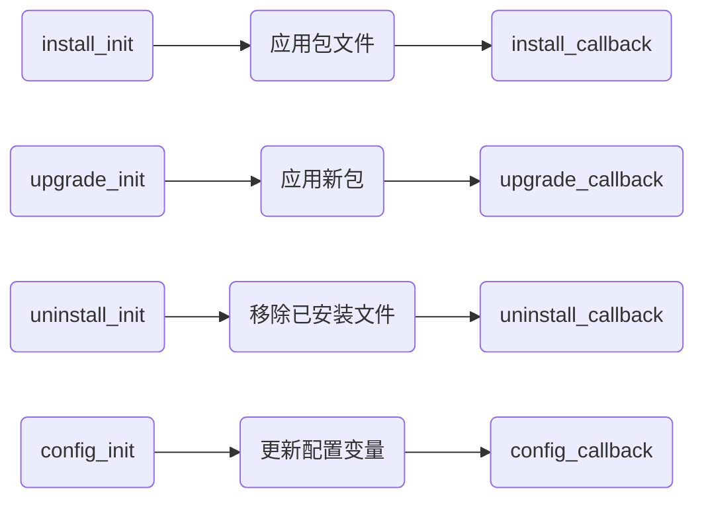

# fnOS (飞牛 OS) FPK Application Specification — Consolidated Reference

Consolidated from the official developer documentation at https://developer.fnnas.com/ plus
empirical inspection of the official `fnpack` 1.2.3 Linux binary.

**Provenance / how this was built**

- Primary source: `https://developer.fnnas.com/llms-full.txt` (machine-readable full-text export of the
  entire developer docs site; 5,219 lines). This export contains every page below verbatim, including
  code blocks. It is generated by the site itself.
- Cross-checked against the rendered pages listed in each section.
- **Empirical section** (marked `[EMPIRICAL]`): `fnpack` 1.2.3 (`https://static2.fnnas.com/fnpack/fnpack-1.2.3-linux-amd64`)
  was downloaded and run to `create` native/docker/`--without-ui` projects and `build` real `.fpk` files.
  The resulting archive was unpacked and inspected. Facts marked `[EMPIRICAL]` are observed behavior of
  the tool, not quoted from the docs; where the tool differs from the docs it is called out.
- Facts NOT present in either the docs or the tool output are listed in **§15 Gaps** — nothing was invented.

Page URL index (all under `https://developer.fnnas.com`):

| Section | Doc page(s) |
| --- | --- |
| Quick start | `/docs/quick-started/prerequisites`, `/docs/quick-started/create-application`, `/docs/quick-started/test-application`, `/docs/quick-started/publish-application` |
| Framework / layout | `/docs/core-concepts/framework` |
| Manifest | `/docs/core-concepts/manifest` |
| Env vars | `/docs/core-concepts/environment-variables` |
| Privilege | `/docs/core-concepts/privilege` |
| Resource | `/docs/core-concepts/resource` |
| Wizard | `/docs/core-concepts/wizard` |
| App entry | `/docs/core-concepts/app-entry` |
| index.cgi | `/docs/core-concepts/index-cgi` |
| Gateway | `/docs/core-concepts/gateway-registration` (old URL `/docs/core-concepts/gateway-authentication` 302-redirects here) |
| Dependency | `/docs/core-concepts/dependency` |
| Middleware | `/docs/core-concepts/middleware` |
| Runtime | `/docs/core-concepts/runtime` |
| Icon | `/docs/core-concepts/icon` |
| Examples | `/docs/examples/native`, `/docs/examples/docker` (`/docs/core-concepts/native` and `/docs/core-concepts/docker` redirect here) |
| CLI | `/docs/cli/fnpack`, `/docs/cli/appcentercli` |
| Update log | `/docs/update-log` |
| Open API (scopes) | `/api/calling`, `/api/platform-config`, `/api/authorization/*`, `/api/page/*`, `/api/error-codes` |

---

## 1. Package project layout, `.fpk` build, and runtime install layout

Sources: `/docs/cli/fnpack`, `/docs/core-concepts/framework`, `/docs/examples/native`, `/docs/examples/docker`
plus `[EMPIRICAL]` fnpack 1.2.3.

### 1.1 Source project tree (what `fnpack` expects)

Documented project structure (`/docs/cli/fnpack`):

```text
myapp/
├── app/
│   ├── ui/
│   │   ├── config
│   │   └── images/
│   └── docker/
│       └── docker-compose.yaml
├── cmd/
│   ├── main
│   ├── install_init
│   ├── install_callback
│   ├── upgrade_init
│   ├── upgrade_callback
│   ├── uninstall_init
│   ├── uninstall_callback
│   ├── config_init
│   └── config_callback
├── config/
│   ├── privilege
│   └── resource
├── wizard/
├── manifest
├── ICON.PNG
└── ICON_256.PNG
```

`fnpack create <appname>` `[EMPIRICAL]` actually generates (native template):

```text
DemoApp/
├── ICON.PNG
├── ICON_256.PNG
├── manifest
├── app/
│   ├── server/            (empty dir)
│   ├── www/               (empty dir)
│   └── ui/
│       ├── config
│       └── images/{icon_64.png, icon_256.png}
├── cmd/{main, install_init, install_callback, upgrade_init,
│        upgrade_callback, uninstall_init, uninstall_callback,
│        config_init, config_callback}
├── config/{privilege, resource}
└── wizard/                (empty dir)
```

`fnpack create <appname> --without-ui true` `[EMPIRICAL]` generates **no `app/` directory at all**
(only `manifest`, `ICON.PNG`, `ICON_256.PNG`, `cmd/*`, `config/*`). Its manifest omits
`desktop_uidir` / `desktop_applaunchname`.

`fnpack create <appname> --template docker` `[EMPIRICAL]` generates `app/docker/docker-compose.yaml`
(plus the same `app/ui/*`, `cmd/*`, `config/*`); its default `config/resource` contains BOTH a
`docker-project` block and a `data-share` block (see §7.4).

### 1.2 fnpack CLI

Source: `/docs/cli/fnpack`.

Downloads (v1.2.3): `fnpack-1.2.3-windows-amd64`, `-linux-amd64`, `-linux-arm64`, `-darwin-amd64`,
`-darwin-arm64`, all at `https://static2.fnnas.com/fnpack/`.

```bash
chmod +x fnpack-1.2.3-linux-amd64
sudo mv fnpack-1.2.3-linux-amd64 /usr/local/bin/fnpack
fnpack --help
```

Commands `[EMPIRICAL]` — `fnpack --help` lists exactly two subcommands: `build`, `create`:

```
fnpack create <appname>                          # native project (default template)
fnpack create <appname> --without-ui true        # service project, no browser UI config
fnpack create <appname> --template docker        # docker project
fnpack create <appname> --template docker --without-ui true
fnpack build                                     # build in current dir -> <appname>.fpk
fnpack build --directory <path>                  # build another directory
```

Flags `[EMPIRICAL]`:
- `create`: `-t, --template string` (values `native` or `docker`, default `native`), `-w, --without-ui` (default false).
- `build`: `-d, --directory string` (default `.`).

Output `[EMPIRICAL]`: prints `Verifying files...` then `Packing in progress...` then
`Packing successfully. The output file <appname>.fpk can be found in the working directory.`
There is **no** separate `verify` subcommand — verification is the built-in pre-pack check (§1.5).

### 1.3 Archive format `[EMPIRICAL]`

**`.fpk` is a gzip-compressed POSIX tar (`.tar.gz`).** `file` reports
`gzip compressed data`. `gzip -dc x.fpk > x.tar` yields `POSIX tar archive`.

Outer tar contents (top level of the `.fpk`):

```text
app.tgz                 <- the app/ tree (+ a copy of config/), itself a gzip tar
cmd/                    <- all lifecycle scripts (main, install_init, ... )
config/privilege
config/resource
ICON.PNG
ICON_256.PNG
manifest                <- manifest with an appended `checksum = <md5 of app.tgz>`
wizard/                 <- wizard/* files if present (e.g. wizard/install)
```

Notes `[EMPIRICAL]`:
- `app.tgz` is itself a gzip tar containing the full `app/` tree **and a duplicate copy of
  `config/privilege` and `config/resource`**. Example `app.tgz` listing: `.DS_Store, config/,
  config/privilege, config/resource, server/, ui/, ui/config, ui/images/icon_64.png,
  ui/images/icon_256.png, www/...`.
- The packed `manifest` gets a `checksum = <32 hex chars>` line appended by fnpack.
  **That value is the MD5 of `app.tgz`** (verified: `md5sum app.tgz` == the appended `checksum`).
- Scripts in `cmd/` are stored with mode `-rw-r--r--` (no exec bit) inside the outer tar;
  `fnpack` docs for CGI say "the packing tool handles executable permission during packing",
  but the observed outer-tar modes for `cmd/*` are not executable. Do not rely on the archive mode.
- The build is **not reproducible byte-for-byte** across runs (tar timestamps), so the manifest
  checksum changes on every build even with identical inputs.

### 1.4 What the user authors vs. what fnpack adds

Authored by the developer: `manifest`, `config/privilege`, `config/resource`, `cmd/*`,
`app/**`, `wizard/*`, `ICON.PNG`, `ICON_256.PNG`.

Added by fnpack: `app.tgz` wrapper, the duplicated `config/` inside `app.tgz`, and the `checksum`
line in `manifest`.

### 1.5 Pre-pack validation performed by `fnpack` (documented)

Source: `/docs/cli/fnpack` "打包检查" table — fnpack checks required files and basic format before
emitting the `.fpk`:

| Path | Type | Requirement |
| --- | --- | --- |
| `manifest` | file | exists, contains required fields |
| `config/privilege` | file | exists, valid JSON |
| `config/resource` | file | exists, valid JSON |
| `ICON.PNG` | file | exists |
| `ICON_256.PNG` | file | exists |
| `app/` | dir | exists |
| `cmd/` | dir | exists |
| `wizard/` | dir | exists |
| `app/{desktop_uidir}/` | dir | must exist when `desktop_uidir` is declared |

Additional validation observed `[EMPIRICAL]` (exact error strings):

- `Packing failed. Required field appname is missing in manifest file`
- `Packing failed. Required field version is missing in manifest file`
- `Packing failed. Required file ICON.PNG is missing`
- `Packing failed. Required file cmd/main is missing`
- `Packing failed. Required file config/resource is missing`
- `Packing failed. The value of appname in manifest is invalid. It can only contain letters, numbers, hyphens (-), underscores (_), and dots (.). It must start and end with a letter or number`
- `Packing failed. The value for platform in manifest is invalid. It must be one of x86, arm, loongarch, risc-v, or all. Default is x86.`
- `Packing failed. The entry name "DemoApp.Application" in "app/ui/config" should start with Foo`
  (i.e. every `.url` entry ID must be prefixed with `manifest.appname`; triggered by an appname/dir mismatch)
- `Packing failed. Compress /tmp/fnpack.xxx/app.tgz file error : lstat /tmp/fnpack.xxx/app/<uidir>: no such file or directory`
  (declared `desktop_uidir` directory does not exist)
- `Packing failed. File "install" is not valid due to JSON format or content validation failure.`
  (any `wizard/*` file that fails JSON parse or schema validation aborts the whole build)

`[EMPIRICAL]` observations that the docs do **not** state:
- `platform` is **not** a required field (a manifest without it builds fine; default `x86`).
- `maintainer` is **not** required.
- Unknown/extra manifest keys are silently accepted (e.g. `totally_unknown_key=1` builds fine).
- The deprecated `arch=x86` key is silently accepted (ignored); the update log says `arch` was
  replaced by `platform`.
- `ctl_stop=maybe` (non-boolean) is accepted without validation.
- The wizard schema is strict: `wizard/install` must be a JSON **array**; each item needs a `label`,
  and `type` must be one of the known enum values (see §5). `[{"stepTitle":"S","items":[{"type":"text","field":"wizard_x"}]}]`
  FAILS (missing `label`); `"type":"banana"` FAILS.

### 1.6 Runtime install layout (`/var/apps/{appname}`)

Source: `/docs/core-concepts/framework` — after install, fnOS creates:

```text
/var/apps/{appname}
├── cmd/
│   ├── install_init
│   ├── install_callback
│   ├── main
│   ├── upgrade_init
│   ├── upgrade_callback
│   ├── uninstall_init
│   ├── uninstall_callback
│   ├── config_init
│   └── config_callback
├── config/
│   ├── privilege
│   └── resource
├── manifest
├── ICON.PNG
├── ICON_256.PNG
├── target -> /vol{n}/@appcenter/{appname}
├── etc    -> /vol{n}/@appconf/{appname}
├── var    -> /vol{n}/@appdata/{appname}
├── tmp    -> /vol{n}/@apptemp/{appname}
├── home   -> /vol{n}/@apphome/{appname}
├── meta
├── shares/
└── wizard/
    ├── install
    ├── upgrade
    ├── uninstall
    └── config
```

Key directories (doc text):
- **`target`** — installed app files and runtime resources.
- **`etc`** — app configuration.
- **`var`** — runtime data that must survive app restarts.
- **`tmp`** — temporary files.
- **`home`** — app-user data.
- **`shares`** — shared directories declared in `config/resource`.
- **`cmd`** — lifecycle scripts.
- **`wizard`** — user forms for install/upgrade/uninstall/config.

So the authored `app/` tree lands under `/var/apps/{appname}/target/` (e.g. the quick-start app's
`app/www` is at `/var/apps/HelloFnos/target/www`, and the native example's `app/server` is at
`${TRIM_APPDEST}/server`). Persistent storage lives on `/vol{n}/@appcenter`, `/vol{n}/@appconf`,
`/vol{n}/@appdata`, `/vol{n}/@apptemp`, `/vol{n}/@apphome`.

Path variables: use `TRIM_APPDEST`, `TRIM_PKGETC`, `TRIM_PKGVAR` etc. rather than hardcoding
(`/docs/core-concepts/framework`).

> Inconsistency to be aware of: the framework diagram names the shared-dir link `shares/`, while
> `/docs/core-concepts/resource` and `/docs/core-concepts/environment-variables` and
> `/docs/examples/native` all use the singular symlink path `/var/apps/{appname}/share/...`
> (e.g. `/var/apps/notepad/share/notes`). Treat both spellings as possibly valid; prefer
> `TRIM_DATA_SHARE_PATHS` over either literal path.

### 1.7 Build example (from `/docs/examples/native`)

The native example wraps frontend+backend into `app/server`, then:

```bash
npm run build          # custom build-combined.js, ends with:
fnpack build --directory notepad
```

yielding `notepad.fpk`. `app/ui/config` in that example is at `notepad/app/ui/config`; the
manifest sets `desktop_uidir=ui`.

---

## 2. `manifest`

Source: `/docs/core-concepts/manifest` (+ `/docs/core-concepts/dependency`, `/docs/core-concepts/runtime`,
`/docs/update-log`, `/api/calling`). The file is named `manifest`, lives in the package root, and
has **no file extension**. Syntax is INI-style `key=value` (also accepted with spaces around `=`;
fnpack's own template emits aligned `key = value`).

### 2.1 Documented keys

| Key | Required (docs) | Type | Meaning |
| --- | --- | --- | --- |
| `appname` | **yes** (empirically required) | string | Unique application identifier. `[EMPIRICAL]` may only contain letters, numbers, `-`, `_`, `.`; must start and end with a letter or number; must match the package directory name and prefix every `app/ui/config` entry ID. |
| `version` | **yes** (empirically required) | string | App version, e.g. `1.0.0` or `2.1.3-beta`. |
| `display_name` | recommended | string | Name shown in app center, app settings and UI. |
| `desc` | recommended | string | App description; HTML content allowed. |
| `source` | recommended | string | App source; third-party apps use `thirdparty`. |
| `platform` | optional (default `x86`) | enum | Supported hardware architecture: `x86`, `arm`, `all` (docs). `[EMPIRICAL]` fnpack 1.2.3 also accepts `loongarch` and `risc-v`; error text: "It must be one of x86, arm, loongarch, risc-v, or all. Default is x86." Use `all` only when the package contains no arch-specific binaries. |
| `maintainer` | recommended | string | Developer or team name. |
| `maintainer_url` | optional | string | Developer website or contact. |
| `distributor` | optional | string | Publisher name, if different from maintainer. |
| `distributor_url` | optional | string | Publisher website or contact. |
| `os_min_version` | optional | string | Minimum supported fnOS version. |
| `os_max_version` | optional | string | Maximum supported fnOS version (when there is a hard compatibility ceiling). |
| `ctl_stop` | optional | bool | Whether app center shows start/stop controls. `true` = show start/stop/status; `false` = hide. Static/config-only apps use `false`. |
| `install_type` | optional | string | Install target. Empty = user chooses the storage volume at install; `root` = install to the system partition. |
| `install_dep_apps` | optional | string list | Dependent apps, separated by `:`. `>` declares a minimum version, e.g. `database>2.2.2:cache`. See §10. |
| `desktop_uidir` | optional | string | UI directory relative to the app dir; default `ui`. |
| `desktop_applaunchname` | optional | string | Entry ID opened from the app-center card when the app has multiple entries; must match an ID in `{desktop_uidir}/config`. |
| `service_port` | optional | number | Application service port. |
| `checkport` | optional | bool | Whether fnOS checks the port before starting the app; default `true`. Apps not listening on a fixed port may omit `service_port` or set `checkport=false`. |
| `disable_authorization_path` | optional | bool | Controls whether the app settings page shows the authorized-directory setting. `false` = user can configure authorized dirs; `true` = hide. Use `true` only if the app never needs user file/dir access. |
| `changelog` | optional | string | Update notes shown during update / in app-center update UI. Keep concise and user-facing. |
| `micro_app` | conditional | bool | `micro_app=true` is **required** if the app uses the front-end JS SDK (`@trimjs/web-app`). Without it the page is not loaded as a micro-app and JS SDK capabilities may not initialize. Source: `/api/calling`. |
| `checksum` | added by fnpack | string | `[EMPIRICAL]` fnpack appends `checksum = <md5 of app.tgz>` to the packaged manifest. Not an author-authored key. |
| `arch` | deprecated | string | Replaced by `platform` per `/docs/update-log` (2025-12-31). `[EMPIRICAL]` still accepted and ignored. |

### 2.2 Keys that are NOT in the current documentation

The following keys were requested but **do not appear anywhere** in the official docs or in the
fnpack 1.2.3 binary output (see §15 Gaps): `ctl_uninstall`, `desktop_appname`, `desktop_apppage`,
`service_path`, `service_protocol`, `install_conflict_apps`, `install_break_apps`,
`install_reboot`, `app_user_group`, `exclude_arch`, `exclude_model`, `exclude_kernel`,
`support_backup`, `package_type`, `trimacl_perm`, `autoCreateDesktopIcon`.
Do **not** rely on them for a current fnOS package.

### 2.3 Documented manifest example

```ini title="manifest"
appname=HelloFnos
version=1.0.0
display_name=Hello fnOS
desc=一个最小的飞牛 fnOS 应用。
source=thirdparty
platform=all

maintainer=Example Team
maintainer_url=https://example.com

os_min_version=1.2.0

desktop_uidir=ui
desktop_applaunchname=HelloFnos.Application

ctl_stop=false
checkport=false
```

### 2.4 Minimal manifest accepted by fnpack 1.2.3 `[EMPIRICAL]`

```ini
appname=DemoApp
version=1.0.0
display_name=D
desc=d
source=thirdparty
platform=x86
```

(fnpack then appends the `checksum` line.)

---

## 3. Environment variables

Source: `/docs/core-concepts/environment-variables`. fnOS exports these to lifecycle scripts and to
the application process. They come from: `manifest` fields, install/config/upgrade wizards, system
runtime context, and app resource/permission settings.

### 3.1 Application info

| Variable | Meaning |
| --- | --- |
| `TRIM_APPNAME` | App name from `manifest.appname`. |
| `TRIM_APPVER` | Current app version. |
| `TRIM_OLD_APPVER` | Previous version during an upgrade. |
| `TRIM_APP_STATUS` | Current operation, e.g. `INSTALL`, `START`, `UPGRADE`, `UNINSTALL`, `STOP`, `CONFIG`. |

### 3.2 Application paths

| Variable | Meaning |
| --- | --- |
| `TRIM_APPDEST` | Installed `target` directory (authored `app/` contents). |
| `TRIM_PKGETC` | App configuration directory (`etc`). |
| `TRIM_PKGVAR` | Runtime data directory (`var`). |
| `TRIM_PKGTMP` | Temporary directory (`tmp`). |
| `TRIM_PKGHOME` | App user data directory (`home`). |
| `TRIM_PKGMETA` | Metadata directory. |
| `TRIM_APPDEST_VOL` | Storage-volume path where the app is installed. |

Use these instead of hardcoding paths.

### 3.3 User and privilege context

| Variable | Meaning |
| --- | --- |
| `TRIM_USERNAME` | Dedicated app user. |
| `TRIM_GROUPNAME` | Dedicated app group. |
| `TRIM_UID` | App user ID. |
| `TRIM_GID` | App group ID. |
| `TRIM_RUN_USERNAME` | User running the current script (may differ during privileged operations). |
| `TRIM_RUN_GROUPNAME` | Group running the current script. |
| `TRIM_RUN_UID` | UID running the current script. |
| `TRIM_RUN_GID` | GID running the current script. |

`TRIM_USERNAME` = the app user; `TRIM_RUN_USERNAME` = the executor of the current script.

### 3.4 Network and resources

| Variable | Meaning |
| --- | --- |
| `TRIM_SERVICE_PORT` | Service port declared by `manifest.service_port`. |
| `TRIM_DATA_SHARE_PATHS` | Data-share paths declared in `config/resource`, `:`-separated. |
| `TRIM_DATA_ACCESSIBLE_PATHS` | User-authorized accessible paths, `:`-separated. |

Shared data dirs are also reachable via symlinks under `/var/apps/myapp/share/`. Validate file
permissions before reading/writing.

### 3.5 Open API authentication

| Variable | Meaning |
| --- | --- |
| `TRIM_API_TOKEN` | Token for calling the Open API from the app backend. Read it from the process env on every call; do not persist it, log it, or ship it to the front end. |

### 3.6 Logs and temp files

| Variable | Meaning |
| --- | --- |
| `TRIM_TEMP_LOGFILE` | Temp log file lifecycle scripts write user-visible error messages to. |
| `TRIM_TEMP_UPGRADE_FOLDER` | Upgrade temp directory. |
| `TRIM_PKGINST_TEMP_DIR` | Install-time extraction temp directory. |
| `TRIM_TEMP_TPKFILE` | Package extraction directory. |

On failure, write a clear message to `TRIM_TEMP_LOGFILE` before exiting non-zero; it may be shown
to the user during install/start/upgrade/config.

### 3.7 System context

| Variable | Meaning |
| --- | --- |
| `TRIM_SYS_VERSION` | Full fnOS version. |
| `TRIM_SYS_VERSION_MAJOR` | Major version. |
| `TRIM_SYS_VERSION_MINOR` | Minor version. |
| `TRIM_SYS_VERSION_BUILD` | Build number. |
| `TRIM_SYS_ARCH` | System CPU architecture. |
| `TRIM_KERNEL_VERSION` | Kernel version. |
| `TRIM_SYS_MACHINE_ID` | Unique device identifier. |
| `TRIM_SYS_LANGUAGE` | System language. |

Use for diagnostics/compat checks; do not let behavior contradict `manifest` compatibility claims.

### 3.8 Wizard variables

Wizard-collected values become environment variables **without** the `TRIM_` prefix and with the
same name as the wizard `field`. A field named `db_port` becomes `$db_port`. Keep names stable;
lifecycle scripts and the app service may depend on them.

### 3.9 Which variables are available where

The docs do not publish a per-script matrix. Stated/implied coverage:
- `TRIM_APP_STATUS`, `TRIM_OLD_APPVER`, `TRIM_TEMP_UPGRADE_FOLDER`, `TRIM_PKGINST_TEMP_DIR`,
  `TRIM_TEMP_TPKFILE` are lifecycle/operation-scoped (install/upgrade/config/start/stop).
- `TRIM_SERVICE_PORT`, `TRIM_DATA_SHARE_PATHS`, `TRIM_DATA_ACCESSIBLE_PATHS`, `TRIM_API_TOKEN`,
  `TRIM_APPDEST`, `TRIM_PKGETC`, `TRIM_PKGVAR`, `TRIM_PKGTMP`, `TRIM_PKGHOME`, `TRIM_PKGMETA`,
  `TRIM_APPDEST_VOL` are used by `cmd/main` and app processes.
- Docker Compose files can consume `TRIM_SERVICE_PORT`, `TRIM_APPDEST`, `TRIM_PKGVAR`,
  `TRIM_DATA_SHARE_PATHS` (`/docs/examples/docker`).
- Wizard values are exposed to lifecycle scripts (`/docs/core-concepts/wizard`).
The exact availability of each variable per script is not enumerated → see Gaps.

### 3.10 Documented sample `cmd/main`

```bash title="cmd/main"
#!/bin/bash

case "$1" in
  start)
    echo "Starting $TRIM_APPNAME $TRIM_APPVER"
    echo "App directory: $TRIM_APPDEST"
    echo "Config directory: $TRIM_PKGETC"
    echo "Data directory: $TRIM_PKGVAR"

    if [ ! -f "$TRIM_PKGETC/config.conf" ]; then
      cp "$TRIM_APPDEST/config.conf.example" "$TRIM_PKGETC/config.conf"
    fi

    cd "$TRIM_APPDEST"
    ./myapp \
      --config "$TRIM_PKGETC/config.conf" \
      --data "$TRIM_PKGVAR" \
      --port "$TRIM_SERVICE_PORT" \
      --log "$TRIM_TEMP_LOGFILE" &
    ;;

  status)
    if pgrep -f "myapp.*$TRIM_SERVICE_PORT" > /dev/null; then
      exit 0
    fi
    exit 3
    ;;

  stop)
    pkill -f "myapp.*$TRIM_SERVICE_PORT"
    ;;

  *)
    echo "Unknown command: $1" > "$TRIM_TEMP_LOGFILE"
    exit 1
    ;;
esac
```

Guidance: custom wizard vars must not use `TRIM_`; check dirs exist; quote variables; treat wizard
and request values as untrusted; use `TRIM_TEMP_LOGFILE` for user-visible errors.

---

## 4. Lifecycle scripts

Source: `/docs/core-concepts/framework`. Scripts live in `cmd/` and are invoked by fnOS.

| Script | When it runs |
| --- | --- |
| `install_init` | Before app files are installed. |
| `install_callback` | After app files are installed. |
| `main` | Handles `start`, `stop`, `status`. |
| `upgrade_init` | Before upgrade. |
| `upgrade_callback` | After upgrade. |
| `uninstall_init` | Before uninstall. |
| `uninstall_callback` | After uninstall cleanup. |
| `config_init` | Before a config change is applied. |
| `config_callback` | After a config change is applied. |

Scripts should be idempotent/re-runnable: install, upgrade and config flows may be re-executed
during development and recovery.

Flows:



- Install: pre-startup checks/initialization go here.
- Upgrade: data migration, config migration, compatibility checks. If the app is running, fnOS may
  stop it before upgrade and restart it afterwards.
- Uninstall: respect user data; if the user chooses keep-vs-delete data, collect it in
  `wizard/uninstall` and act in the uninstall scripts.
- Config: update files, restart services, or notify the app process.

### 4.1 `cmd/main` contract

```bash title="cmd/main"
#!/bin/bash

case "$1" in
  start)
    # Start the application service.
    exit 0
    ;;

  stop)
    # Stop the application service.
    exit 0
    ;;

  status)
    # Return 0 when running, 3 when not running.
    exit 0
    ;;

  *)
    exit 1
    ;;
esac
```

Exit codes (documented):
- `0` — success; in `status` it means "running".
- `1` — failure.
- `3` — in `status` only, "not running".

`main` receives the action as `$1` (`start` | `stop` | `status`). Static apps may set
`ctl_stop=false` in `manifest` to hide run controls.

`[EMPIRICAL]` fnpack's generated `cmd/main` template:
- writes logs to `${TRIM_PKGVAR}/info.log` and a PID file to `${TRIM_PKGVAR}/app.pid`;
- `start_process` runs `bash -c "${CMD}" >> ${LOG_FILE} 2>&1 &` and writes `$!` to the PID file;
- `stop_process` sends `TERM`, waits up to 10 s, then `KILL`;
- `status` returns 0 if the PID is alive, else 3; unknown action exits 1.
- `cmd/install_init` etc. templates are trivial: `#!/bin/bash` + a comment + `exit 0`.
- The generated scripts have no exec bit in the source dir (fnOS invokes them via its own runner).

### 4.2 User-visible errors

Write a short, actionable message to `TRIM_TEMP_LOGFILE` before returning a failure code:

```bash title="cmd/main"
if [ ! -f "$TRIM_PKGETC/config.conf" ]; then
  echo "Missing configuration file." > "$TRIM_TEMP_LOGFILE"
  exit 1
fi
```

These may be shown to the user during install, start, upgrade or config. `stdout`/`stderr` are not
documented as a user-visible channel; `TRIM_TEMP_LOGFILE` is the documented mechanism.

### 4.3 Docker apps

`[EMPIRICAL]`/docs: for `docker-project` apps, fnOS starts/stops containers itself; `cmd/main`
`start`/`stop` are usually no-ops and only `status` must accurately report whether the app is
running (e.g. `docker inspect <container> | grep -q '"Status": "running"'`).

---

## 5. `wizard`

Source: `/docs/core-concepts/wizard`. Four files:

- `wizard/install` — shown at install.
- `wizard/upgrade` — shown at upgrade.
- `wizard/uninstall` — shown at uninstall.
- `wizard/config` — shown from the app settings page after install; submitted values continue to be
  provided to the app as environment variables (this is the "settings page" form).

### 5.1 File format

Each wizard file is a **JSON array of steps**. Each step:

- `stepTitle` — step title.
- `items` — array of form items.

Each item:

- `type` — field type (see table).
- `field` — field name; the collected value becomes an env var of the same name.
- `label` — display label.
- `initValue` — default value.
- `options` — for choice fields: array of `{ "label": ..., "value": ... }`.
- `helpText` — for `tips`.
- `rules` — validation rules.

Field types:

| Type | Purpose |
| --- | --- |
| `text` | Short text: ports, paths, usernames, ordinary values. |
| `password` | Secrets/tokens that must not be shown in clear text. |
| `radio` | Small set of mutually exclusive options. |
| `checkbox` | Multiple-choice options. |
| `select` | Longer mutually exclusive option list. |
| `switch` | Boolean-style option. |
| `tips` | Read-only informational text. |

Validation rules (`rules` array):
- `required` — required (with `message`).
- `min` / `max` — length or numeric range.
- `len` — fixed length.
- `pattern` — regex (with `message`).

> `[EMPIRICAL]` fnpack 1.2.3 enforces this schema at pack time: the file must be a JSON array, each
> item must carry a `label`, and `type` must be one of the enum values above. Any violation aborts
> the build with `Packing failed. File "<name>" is not valid due to JSON format or content
> validation failure.` No separate `file` type was found in the docs or accepted by fnpack.

### 5.2 How answers reach scripts

Values become env vars named exactly after `field` (e.g. `wizard_username` → `$wizard_username`).
Convention: prefix custom fields with `wizard_`; never use `TRIM_` (reserved for the system).
Treat values as strings and re-validate them inside scripts.

### 5.3 Complete examples

`wizard/install` (documented structure, extended to be realistic; valid per fnpack):

```json title="wizard/install"
[
  {
    "stepTitle": "Setup",
    "items": [
      {
        "type": "text",
        "field": "wizard_username",
        "label": "Username",
        "initValue": "admin",
        "rules": [
          { "required": true, "message": "Enter a username" }
        ]
      },
      {
        "type": "text",
        "field": "wizard_port",
        "label": "Service port",
        "initValue": "8080",
        "rules": [
          { "required": true, "message": "Enter a port" },
          { "pattern": "^[0-9]+$", "message": "Use numbers only" }
        ]
      },
      {
        "type": "select",
        "field": "wizard_database_type",
        "label": "Database",
        "initValue": "sqlite",
        "options": [
          { "label": "SQLite", "value": "sqlite" },
          { "label": "PostgreSQL", "value": "postgresql" }
        ]
      },
      {
        "type": "password",
        "field": "wizard_admin_password",
        "label": "Admin password",
        "rules": [
          { "required": true, "message": "Enter a password" }
        ]
      },
      {
        "type": "switch",
        "field": "wizard_enable_metrics",
        "label": "Enable metrics",
        "initValue": "false"
      },
      {
        "type": "tips",
        "helpText": "Review the configuration before continuing."
      }
    ]
  }
]
```

`wizard/config` (settings page) uses the same array/step/item schema; submitted values again become
env vars for the app. `wizard/uninstall` is typically a `checkbox`/`switch` asking whether to keep
user data; `wizard/upgrade` is used for migration decisions. The docs give no separate schema for
these three beyond the shared format above.

Usage inside a lifecycle script:

```bash title="cmd/install_callback"
#!/bin/bash

echo "Database type: $wizard_database_type"
echo "Service port: $wizard_port"
```

`appcenter-cli` accepts wizard values for non-interactive installs via an env file:

```ini title="config.env"
wizard_admin_username=admin
wizard_database_type=sqlite
wizard_app_port=8080
wizard_agree_terms=true
```

```bash
appcenter-cli install-fpk myapp.fpk --env config.env
```

### 5.4 install wizard vs config (settings) wizard

Both share the identical JSON schema. Difference: `wizard/install` is shown once during install;
`wizard/config` is shown from the app settings page after install and can be edited repeatedly, with
values re-fed to the app. `config_init`/`config_callback` bracket the config change.

---

## 6. `config/privilege`

Source: `/docs/core-concepts/privilege`. Defines which user the app runs as. Use least privilege.

### 6.1 Schema

```json title="config/privilege"
{
  "defaults": {
    "run-as": "package"
  },
  "username": "myapp_user",
  "groupname": "myapp_group"
}
```

Fields:
- `defaults.run-as` — run identity. Legal documented value: `package` (dedicated app user) and
  `root`. `package` means run as the dedicated user/group defined by `username`/`groupname`.
- `username` — dedicated user name. If omitted, fnOS derives it from `manifest.appname`.
- `groupname` — dedicated group name. If omitted, fnOS derives it from `manifest.appname`.
- `join-groups` — optional array of additional system groups to add the app user to.

### 6.2 `join-groups`

For resources controlled by system groups (e.g. video devices, GPU rendering, hardware-accelerated
media output), add the app user to groups such as `video` or `render`:

```json title="config/privilege"
{
  "defaults": {
    "run-as": "package"
  },
  "username": "media_app",
  "groupname": "media_app",
  "join-groups": ["required_system_group"]
}
```

The app still runs as the package user; `join-groups` only widens group-based access. Add only what
is needed.

### 6.3 Root mode

```json title="config/privilege"
{
  "defaults": {
    "run-as": "root"
  },
  "username": "myapp_user",
  "groupname": "myapp_group"
}
```

Not recommended for ordinary apps. Use only when lifecycle scripts genuinely need privileged
preparation. Long-running user-facing processes should drop privileges, e.g.:

```bash title="cmd/main"
runuser -u "$TRIM_USERNAME" -- /var/apps/myapp/target/server/myapp
```

### 6.4 Minimal default `[EMPIRICAL]`

`fnpack create` emits exactly:

```json title="config/privilege"
{
    "defaults":
    {
        "run-as": "package"
    }
}
```

with no `username`/`groupname` (fnOS derives them from `appname`).

### 6.5 User file access

Apps do not get broad access to user files by default. Two mechanisms:
- the user authorizes directories in app settings, or
- the app declares shared data directories in `config/resource` (`data-share`).

---

## 7. `config/resource`

Source: `/docs/core-concepts/resource`, `/api/calling`. Declares system resources/integrations.
Only declare what the app actually uses.

### 7.1 `data-share`

```json title="config/resource"
{
  "data-share": {
    "shares": [
      { "name": "myapp/documents" },
      { "name": "myapp/backups" }
    ]
  }
}
```

- `name` — shared path name.
- `permission` — optional; grants access to other users/apps. Most shares need none.

At install, fnOS creates the declared shared dirs. They use the **Windows ACL** model (not POSIX
ACL); fnOS automatically grants the app's run user the needed ACLs. The app can read the paths from
`TRIM_DATA_SHARE_PATHS` or reach them via symlinks under `/var/apps/myapp/share/` (e.g.
`/var/apps/myapp/share/documents`). Recommended naming: top-level dir = app name, subdirs by purpose
(`myapp/documents`, `myapp/backups`).

With permissions:

```json title="config/resource"
{
  "data-share": {
    "shares": [
      {
        "name": "myapp/documents",
        "permission": {
          "rw": ["other_app_user"],
          "ro": ["report_reader"]
        }
      }
    ]
  }
}
```

- `rw` — users with read/write access.
- `ro` — users with read-only access.

(`[EMPIRICAL]` fnpack's default native resource file declares two shares: `{appname}` and
`{appname}/data`.)

### 7.2 `usr-local-linker`

Expose commands/libraries/config files to standard system locations:

```json title="config/resource"
{
  "usr-local-linker": {
    "bin": [ "bin/myapp-cli" ],
    "lib": [ "lib/mylib.so" ],
    "etc": [ "etc/myapp.conf" ]
  }
}
```

- `bin` → linked into `/usr/local/bin/`.
- `lib` → linked into `/usr/local/lib/`.
- `etc` → linked into `/usr/local/etc/`.

Only expose stable interfaces others need. Avoid generic executable names (`cli`, `server`,
`tool`); prefer app-identified names (`myapp-cli`) to avoid collisions.

### 7.3 `docker-project`

Project structure:

```text
myapp/
├── app/
│   └── docker/
│       └── docker-compose.yaml
├── manifest
├── cmd/
└── config/
    └── resource
```

```json title="config/resource"
{
  "docker-project": {
    "projects": [
      { "name": "myapp-stack", "path": "docker" }
    ]
  }
}
```

- `name` — Docker Compose project name.
- `path` — path relative to the `app` directory; must contain `docker-compose.yaml`.

`[EMPIRICAL]` the docker template's default resource file combines both blocks:

```json
{
  "docker-project": {
    "projects": [ { "name": "DkApp", "path": "docker" } ]
  },
  "data-share": {
    "shares": [ { "name": "DkApp" }, { "name": "DkApp/data" } ]
  }
}
```

### 7.4 `api-scope` (Open API permissions)

Source: `/api/calling`, `/api/authorization/*`, `/api/page/*`, `/api/platform-config`. Declared as a
JSON array in `config/resource`:

```json
{
  "api-scope": [
    "trim.file.userAccess",
    "trim.file.userAcl"
  ]
}
```

Full list of valid scopes enumerated by the docs (each maps to a set of front-end JS SDK and/or
backend API capabilities):

| Scope string | Capability | Backend API `req` / JS SDK methods using it |
| --- | --- | --- |
| `trim.file.sharedAccess` | App shared-authorization management | `pickSharedFile`, `authorizeSharedFile` (JS SDK); `trim.file.getSharedAccessibleFolders`, `trim.file.delSharedAccessibleFolder` |
| `trim.file.userAccess` | Current-user authorization management | `pickUserFile`, `authorizeUserFile` (JS SDK); `trim.file.getUserAccessibleFolders`, `trim.file.delUserAccessibleFolder` |
| `trim.file.userAcl` | File permission check | `trim.file.checkUserACL` |
| `trim.file.path` | Path conversion | `trim.file.convertPath` |
| `trim.system.getPlatformConfig` | Read platform config (language/version) from backend | `trim.system.getPlatformConfig` |

Notes:
- Page-routing and page-UI JS SDK methods (`openFile`, `showFileDetails`, `openFileManager`,
  `openAppSetting`, `openURL`, `setTitle`, `$on('os/theme')`, `$on('os/language')`,
  `setExitPageTips`, `close`) require **no** scope.
- Open API features require fnOS ≥ `1.2.0401` and App ≥ `1.34.0`.
- Declaring a scope is only a precondition; actual access still depends on user/admin grants and
  token validation.
- Backend API is called via Unix socket `POST /api/v1/trim_open_gateway_apiscope.socket` with
  `Authorization: Bearer $TRIM_API_TOKEN`; body `{"reqId","req","appName","data"}`; response
  `{"reqId","code","msg","data"}` with `code: 0` = success. Never call it from the browser.

---

## 8. App entry / UI registration (`app/ui/config`, `.url`)

Sources: `/docs/core-concepts/app-entry`, `/docs/core-concepts/index-cgi`,
`/docs/core-concepts/gateway-registration`, `/docs/core-concepts/icon`.

The entry config file is `app/ui/config` when `manifest.desktop_uidir=ui`. Entries are defined under
the top-level `.url` object. Entry IDs must be stable and prefixed with the `appname`
(e.g. `myapp.main`). `manifest.desktop_applaunchname` selects which entry the app-center card opens.

Common structure:

```text
myapp/
├── app/
│   └── ui/
│       ├── config
│       └── images/
│           ├── icon_64.png
│           └── icon_256.png
├── manifest
└── config/
```

### 8.1 `.url` entry fields

| Field | Meaning |
| --- | --- |
| `title` | Entry name shown to the user. |
| `icon` | Icon path relative to the UI dir. `{0}` is replaced by the required size, e.g. `images/icon_{0}.png` → `icon_64.png` / `icon_256.png`. |
| `type` | Open mode: `iframe` = open inside the fnOS desktop window; `url` = open in a browser tab / external web view. |
| `protocol` | `http`, `https`, or empty string to let the system adapt to the current access method. Ignored by CGI and gateway entries. |
| `port` | Service port. Wizard-collected ports may be referenced as `${wizard_port}`. Ignored by CGI and gateway entries. |
| `url` | Path the entry opens. Wizard-collected paths may be referenced as `${wizard_path}`. |
| `allUsers` | Whether the entry is visible to all users. |
| `fileTypes` | File extensions this entry handles (file-open registration). |
| `noDisplay` | Hide the entry on the desktop but keep the file-open entry. |
| `control` | Optional object for entry settings in app settings. Documented sub-key: `control.accessPerm` = `editable` (user can edit) / `readonly` (view only) / `hidden`. |
| `gatewayPrefix` | Unified-gateway public path, `/app/{appname}` or `/app/{appname}/{customPath}`. |
| `gatewaySocket` | Socket file name only, e.g. `app.sock`; socket must live in the installed `target` dir. |

`control.portPerm` and `control.pathPerm` were requested but are **not documented** (see Gaps);
only `control.accessPerm` appears.

### 8.2 Desktop icon (port service)

```json title="app/ui/config"
{
  ".url": {
    "myapp.main": {
      "title": "My App",
      "icon": "images/icon_{0}.png",
      "type": "iframe",
      "protocol": "http",
      "port": "8080",
      "url": "/",
      "allUsers": true
    }
  }
}
```

Admin-only entry example:

```json title="app/ui/config"
{
  ".url": {
    "myapp.admin": {
      "title": "Admin Console",
      "icon": "images/admin_{0}.png",
      "type": "iframe",
      "protocol": "http",
      "port": "8080",
      "url": "/admin",
      "allUsers": false,
      "control": { "accessPerm": "readonly" }
    }
  }
}
```

### 8.3 File-open registration

```json title="app/ui/config"
{
  ".url": {
    "myapp.editor": {
      "title": "Text Editor",
      "icon": "images/editor_{0}.png",
      "type": "iframe",
      "protocol": "http",
      "port": "8080",
      "url": "/edit",
      "allUsers": true,
      "fileTypes": ["txt", "md", "json"],
      "noDisplay": true
    }
  }
}
```

When the user opens a file via this entry, fnOS appends a `path` query parameter:

```text
http://localhost:8080/edit?path=/vol1/Users/admin/Documents/example.txt
```

Treat the file path as untrusted input; verify access rights before reading/modifying.

### 8.4 Three access models

| Capability | `index.cgi` | Unified gateway |
| --- | --- | --- |
| Simple static page | suitable | supported |
| Long-running service | not recommended | suitable |
| WebSocket | not supported | supported |
| NAS login state | validated before invoking CGI | validated before forwarding; user headers provided |
| Performance | starts a CGI process per request | forwards to a long-running service |
| Code adaptation | static pages / simple packages need little change | service must adapt to gateway routing + auth |
| Common path | `/cgi/ThirdParty/{appname}/index.cgi/` | `/app/{appname}` |

Port service is the third option: the entry opens the app's own port and is independent of the NAS
login state.

### 8.5 `index.cgi`

- Provide an executable `app/ui/index.cgi`.
- For CGI entries, `protocol` and `port` are **ignored**; the request reuses the current access
  domain and the configured `url` path. fnOS validates the NAS user login before invoking the CGI.
- CGI handles only plain HTTP (no WebSocket). Use a port service or the gateway for background
  processes, WebSocket, streaming, long requests, or high-traffic/complex APIs.
- Typical entry URL: `/cgi/ThirdParty/{appname}/index.cgi/`.
- fnpack handles executable permission during packing (docs); if testing manually on the device,
  make sure the file is executable.

Documented static-file CGI sample (verbatim):

```bash title="app/ui/index.cgi"
#!/bin/bash

BASE_PATH="/var/apps/HelloFnos/target/www"
URI_NO_QUERY="${REQUEST_URI%%\?*}"
REL_PATH="/"

case "$URI_NO_QUERY" in
  *index.cgi*)
    REL_PATH="${URI_NO_QUERY#*index.cgi}"
    ;;
esac

if [ -z "$REL_PATH" ] || [ "$REL_PATH" = "/" ]; then
  REL_PATH="/index.html"
fi

TARGET_FILE="${BASE_PATH}${REL_PATH}"

if echo "$TARGET_FILE" | grep -q '\.\.'; then
  echo "Status: 400 Bad Request"
  echo "Content-Type: text/plain; charset=utf-8"
  echo ""
  echo "Bad Request"
  exit 0
fi

if [ ! -f "$TARGET_FILE" ]; then
  echo "Status: 404 Not Found"
  echo "Content-Type: text/plain; charset=utf-8"
  echo ""
  echo "404 Not Found"
  exit 0
fi

case "${TARGET_FILE##*.}" in
  html|htm) mime="text/html; charset=utf-8" ;;
  css) mime="text/css; charset=utf-8" ;;
  js) mime="application/javascript; charset=utf-8" ;;
  png) mime="image/png" ;;
  jpg|jpeg) mime="image/jpeg" ;;
  svg) mime="image/svg+xml" ;;
  *) mime="application/octet-stream" ;;
esac

echo "Content-Type: $mime"
echo ""
cat "$TARGET_FILE"
```

CGI security: reject `..` traversal; serve only from the expected app dir; return explicit status
codes; never execute request parameters as commands; never splice request paths into shell commands.

### 8.6 Unified gateway

How it works:
1. The app registers a public path via `gatewayPrefix`.
2. The app service listens on the Unix socket declared by `gatewaySocket`.
3. The user opens the gateway path, e.g. `/app/myapp`.
4. fnOS validates the user session.
5. fnOS forwards the request to `/var/apps/myapp/target/app.sock`.
6. The app reads the gateway-forwarded user headers when it needs user context.

Entry config:

```json title="app/ui/config"
{
  ".url": {
    "myapp.main": {
      "title": "My App",
      "icon": "images/icon_{0}.png",
      "type": "iframe",
      "protocol": "",
      "gatewayPrefix": "/app/myapp",
      "gatewaySocket": "app.sock",
      "url": "/app/myapp",
      "allUsers": true
    }
  }
}
```

Rules:
- `protocol` and `port` are ignored for gateway entries.
- `gatewayPrefix`: `/app/{appname}` or `/app/{appname}/{customPath}`; keep stable; use simple
  URL-safe names; avoid dots in the public path.
- `gatewaySocket`: filename only (`app.sock`); the socket must be in the installed `target` dir
  (locate it with `${TRIM_APPDEST}`).

Requirements:
- The app service listens on the `gatewaySocket` Unix socket.
- Docker apps can use the gateway by mounting `${TRIM_APPDEST}` into the container and creating the
  socket there.
- Keep HTTP and WebSocket routes under the declared `gatewayPrefix`.
- Do not trust client-supplied user IDs; use the fnOS-forwarded auth headers.

Forwarded headers after session validation:

| Header | Meaning | Example |
| --- | --- | --- |
| `X-Trim-Userid` | Current user UID | `1000` |
| `X-Trim-Isadmin` | Whether the current user is an admin | `true` / `false` |
| `X-Trim-Username` | Current username | `admin` |

```http title="Forwarded request"
GET /app/myapp/list HTTP/1.1
X-Trim-Userid: 1000
X-Trim-Isadmin: true
X-Trim-Username: admin
```

```js title="Node.js"
function getGatewayUser(req) {
  return {
    uid: req.headers["x-trim-userid"],
    isAdmin: req.headers["x-trim-isadmin"] === "true",
    username: req.headers["x-trim-username"]
  };
}
```

WebSocket reuses the same prefix/socket; recommended sub-path `/app/myapp/ws`:

```js title="WebSocket connection"
const wsProtocol = window.location.protocol === "https:" ? "wss:" : "ws:";
const wsUrl = `${wsProtocol}//${window.location.host}/app/myapp/ws`;

const socket = new WebSocket(wsUrl);

socket.onopen = () => {
  socket.send(JSON.stringify({ type: "ping" }));
};

socket.onmessage = (event) => {
  const message = JSON.parse(event.data);
  console.log(message);
};
```

Bind the connection to `X-Trim-Userid` at connect time; never trust user IDs in WebSocket messages.
The gateway validates login state but not business permissions — the app must enforce its own
authorization (own-data-only, admin-only endpoints, path/record validation, no `..`, only serve
from expected dirs, never expose secrets/config/private logs).

### 8.7 Serving a UI so it works both behind the gateway and on a direct LAN port

The documented pattern (`/docs/examples/native`) is:
- Mount the same router on both `/` and the gateway prefix:
  `app.use("/", router); app.use(GATEWAY_PREFIX, router);`
- Serve static assets on both the gateway prefix and root:
  `app.use(GATEWAY_PREFIX, express.static(STATIC_DIR)); app.use(express.static(STATIC_DIR));`
- Use **relative** API paths from the front end so no host is hardcoded; during local development
  set the front-end base/proxy to the gateway prefix (`base: "/app/notepad/"`, dev proxy
  `"/app/notepad": "http://localhost:5001"`) to simulate the gateway.
- At runtime pick the listener: `if (SOCKET_PATH) app.listen(SOCKET_PATH) else app.listen(PORT)`,
  where `SOCKET_PATH="${TRIM_APPDEST}/app.sock"` and `PORT` is only used for local dev.
- Read the current user from `X-Trim-Userid` (fall back to `local` when absent locally).

---

## 9. Icons

Source: `/docs/core-concepts/icon`.

Package icons, in the package root (required by fnpack):
- `ICON.PNG` — 64 × 64 px.
- `ICON_256.PNG` — 256 × 256 px.

Requirements:
- Format: PNG or JPG (the required file names use `.PNG`).
- Color space: sRGB.
- File size: ≤ 1024 KB.
- Canvas: a full square image.
- Corners: the icon's visual subject should use a rounded-rectangle style; do not fill the canvas
  with a hard square. Rounded corners, padding and shadows should match system icons.
- The two sizes must share one visual identity; the 64 px version must remain legible; keep
  important content away from the edges and avoid fine text/decoration.

Entry icons (desktop icons / file-open registrations) live under the UI dir, recommended
`app/ui/images/`:

```text
myapp/
└── app/
    └── ui/
        ├── config
        └── images/
            ├── icon_64.png
            └── icon_256.png
```

Referenced from `app/ui/config` with `"icon": "images/icon_{0}.png"`; fnOS substitutes `{0}` with
the needed size.

Checklist before packing: root contains both `ICON.PNG` and `ICON_256.PNG`; ≤ 1024 KB; 64 px
legible; rounded-rectangle subject; if the entry uses `images/icon_{0}.png`, both `icon_64.png`
and `icon_256.png` are present in the UI dir.

---

## 10. Dependencies (`install_dep_apps`)

Sources: `/docs/core-concepts/dependency`, `/docs/core-concepts/runtime`,
`/docs/core-concepts/middleware`, `/docs/examples/native`.

```ini title="manifest"
install_dep_apps=database:cache
```

- Multiple dependencies are separated by `:`.
- **Order:** fnOS installs and enables dependencies **right to left**. `database:cache` means
  `cache` is prepared before `database`.
- **Version requirement:** `>` declares the minimum version, e.g. `database>2.2.2:cache`.
- **Nested dependencies are NOT resolved recursively.** If the app needs both `database` and
  `cache`, declare both directly even if one depends on the other.

### 10.1 How the dependent app's binaries are located at runtime

The docs do **not** put a dependency's binaries on `PATH` automatically. The documented pattern is
that the app must **resolve them manually** by exporting the dependency's `target/bin` into `PATH`:

```ini title="manifest"
install_dep_apps=nodejs_v22
```

```bash
export PATH=/var/apps/nodejs_v22/target/bin:$PATH

node -v
npm -v
```

Python:

```ini title="manifest"
install_dep_apps=python312
```

```bash
export PATH=/var/apps/python312/target/bin:$PATH

python3 -m venv .venv
source .venv/bin/activate
pip install -r requirements.txt
```

Java:

```ini title="manifest"
install_dep_apps=java-21-openjdk
```

```bash
export PATH=/var/apps/java-21-openjdk/target/bin:$PATH

java --version
```

So a dependency installed as app `X` lives at `/var/apps/X/target/` and its executables at
`/var/apps/X/target/bin/`; the app is responsible for adding that to `PATH` (or invoking by absolute
path). The native example does exactly `export PATH=/var/apps/nodejs_v22/target/bin:$PATH` in
`cmd/main`.

### 10.2 Known dependency app names appearing in the docs

- Runtime packages: `nodejs_v22`, `python312`, `java-21-openjdk`.
- Middleware services: `redis`, `minio`, `rabbitmq`.
- Generic illustrative names used in dependency examples: `database`, `cache`.

`nodejs_v24` and other version variants were **not** found in the documentation (see Gaps).

### 10.3 Middleware usage notes

- Redis (`install_dep_apps=redis`): connect to `127.0.0.1:6379`; use a distinct DB number or key
  prefix to avoid collisions.
- MinIO (`install_dep_apps=minio`): endpoint `127.0.0.1:9000`; namespace buckets; never hardcode
  production credentials in the package.
- RabbitMQ (`install_dep_apps=rabbitmq`): broker on `127.0.0.1:5672`; use app-specific queues,
  exchanges and routing keys.
- Only declare middleware actually needed; test on a clean fnOS device; surface clear user-visible
  errors when a service is unavailable.

---

## 11. Runtime: start/stop, autostart, logs

Sources: `/docs/core-concepts/framework`, `/docs/core-concepts/runtime`,
`/docs/examples/native`, `/docs/examples/docker`.

- **Start/stop:** fnOS drives `cmd/main` with `start` / `stop` / `status`. `status` exit codes:
  `0` = running, `3` = not running. `ctl_stop` in the manifest controls whether the app center shows
  manual start/stop controls. For `docker-project` apps, fnOS starts/stops the containers and
  `cmd/main` mainly needs a correct `status`.
- **Autostart on boot:** the docs do not describe a manifest key for boot autostart. The framework
  and runtime pages present apps as managed by fnOS, which starts apps as part of its own lifecycle;
  no explicit "autostart" flag is documented (see Gaps).
- **Logs:** the docs specify no fixed system log directory. The documented convention is that the
  app writes its own logs under `TRIM_PKGVAR` (the `var` directory, i.e. `/vol{n}/@appdata/{appname}`):
  the native example writes `${TRIM_PKGVAR}/app.log`; the fnpack template writes
  `${TRIM_PKGVAR}/info.log`. The quick-start CGI app writes nothing to a log.
- **stdout/stderr of `cmd/main`:** the docs do not define where fnOS redirects them. The
  documented, reliable channel for user-visible messages is `TRIM_TEMP_LOGFILE`. For a long-running
  service, the template/native pattern is to redirect the service's stdout/stderr into a file under
  `TRIM_PKGVAR` (e.g. `node server.js >> "$LOG_FILE" 2>&1 &`). There is no documented
  `/var/log/apps/...` path.
- **Runtime environments** (Python/Node/Java) are provisioned via `install_dep_apps` and added to
  `PATH` by the app's own scripts (§10.1).

---

## 12. Install/security/validation and local testing

Sources: `/docs/cli/appcentercli`, `/docs/quick-started/test-application`,
`/docs/quick-started/publish-application`, `/docs/cli/fnpack`, `/docs/update-log`.

### 12.1 `appcenter-cli` commands

```bash
appcenter-cli install-fpk myapp.fpk                 # install an FPK
appcenter-cli install-fpk myapp.fpk --env config.env # non-interactive wizard values
appcenter-cli install-local                          # run from a project dir on the device (packages + installs)
appcenter-cli default-volume                         # show default install volume
appcenter-cli default-volume 1                       # set default install volume
appcenter-cli list                                   # list installed apps
appcenter-cli start myapp                            # start an app
appcenter-cli stop myapp                             # stop an app
```

- `install-local` must be run from the project directory (`cd /path/to/myapp && appcenter-cli install-local`).
- Env file for wizard apps (INI `key=value`), e.g.:
  ```ini title="config.env"
  wizard_admin_username=admin
  wizard_database_type=sqlite
  wizard_app_port=8080
  wizard_agree_terms=true
  ```
  Env files containing accounts/passwords/tokens must not be committed.

### 12.2 Installing a local FPK for testing

- **App center UI:** open App Center → manual-install entry → select `HelloFnos.fpk`. Manual install
  is for local testing only and must not be used as a public distribution method.
- **CLI:** `appcenter-cli install-fpk <file>.fpk` (scriptable/CI), optionally `--env`.
- After install, open the desktop entry and verify. Repeat loop: `fnpack build` → install new
  `.fpk` → reopen the entry. Service apps should also be checked for process state, port and logs.

### 12.3 Validation enforced on install / at pack time

- **Pack time (fnpack):** required files/fields and JSON validity (§1.5); `platform` enum; appname
  charset; entry-ID prefix must equal appname; wizard JSON schema. Any failure aborts packing.
- **Integrity:** `[EMPIRICAL]` fnpack appends `checksum = <md5 of app.tgz>` to the packaged
  manifest. The docs do not describe how/whether fnOS verifies it, nor any signature scheme
  (no `signature`/signing key is documented).
- **Install time:** docs mention compatibility checks against `os_min_version`/`os_max_version`
  and dependency installation via `install_dep_apps`, and that `checkport` controls a pre-start port
  check. No dry-run/inspection subcommand is documented beyond the pack-time checks and
  `appcenter-cli list`.
- **Publishing:** submit via the app-center developer group (process described in
  `/docs/quick-started/publish-application`); prepare the `fnpack`-built `.fpk`, icons and real
  screenshots; test on all claimed fnOS versions/architectures.

### 12.4 `fnpack` version / changelog notes

`/docs/update-log` records: fnpack V1.0.4 → V1.2.0 (2025-12-31; pre-pack validation rules added,
Linux ARM build added; `manifest.arch` deprecated in favor of `platform`; entry config supports env
vars) → V1.2.3 (2026-07-05). Open API requires fnOS ≥ 1.2.0401 and App ≥ 1.34.0.

---

## 13. Quick-start end-to-end (HelloFnos, no port)

Source: `/docs/quick-started/create-application`, `/docs/quick-started/test-application`.

```bash
fnpack create HelloFnos
# add app/www/index.html
# manifest:
#   appname="HelloFnos" version="1.0.0" display_name="Hello fnOS"
#   desc="..." maintainer="Your Name" maintainer_url="https://example.com"
#   source="thirdparty" platform="all" ctl_stop=false
# config/privilege:
#   {"defaults":{"run-as":"package"},"username":"hellofnos","groupname":"hellofnos"}
# app/ui/config:
#   {".url":{"HelloFnos.Application":{"title":"Hello fnOS","icon":"images/icon_{0}.png",
#    "type":"iframe","url":"/cgi/ThirdParty/HelloFnos/index.cgi/","allUsers":true}}}
# app/ui/index.cgi: CGI static server (BASE_PATH=/var/apps/HelloFnos/target/www)
fnpack build          # -> HelloFnos.fpk
appcenter-cli install-fpk HelloFnos.fpk
```

Troubleshooting checklist from the docs: entry URL should be
`/cgi/ThirdParty/HelloFnos/index.cgi/`; `index.cgi`'s `BASE_PATH` should point to
`/var/apps/HelloFnos/target/www`; the target page must exist in the package.

---

## 14. Docker application summary

Source: `/docs/examples/docker`.

```bash
fnpack create hello-docker --template docker
```

- `manifest`: `appname`, `version`, `display_name`, `desc`, `source=thirdparty`, `platform=all`,
  `maintainer`, `distributor`, `desktop_uidir=ui`, `desktop_applaunchname=hello-docker.main`,
  `service_port=8080`, `checkport=true`, `ctl_stop=true`.
- `app/docker/docker-compose.yaml` can use `${TRIM_SERVICE_PORT}`, `${TRIM_APPDEST}`,
  `${TRIM_PKGVAR}`, `${TRIM_DATA_SHARE_PATHS}`.
- `config/resource` declares `docker-project.projects[].{name,path}`.
- `cmd/main`: `start`/`stop` no-ops, `status` checks the container.
- `app/ui/config` entry `port` must match `manifest.service_port` and the compose mapping.
- Docker apps may use the unified gateway by mounting `${TRIM_APPDEST}` and creating `app.sock`.
- `platform=all` is fine for the package, but the image itself must support the target architecture.
- Debugging: entry won't open → check `service_port`, compose port mapping and entry `port`;
  status always "not running" → check `CONTAINER_NAME` vs compose `container_name`; image won't
  start → check registry reachability and image architecture.

---

## 15. Gaps

Explicitly not answered by the official docs (and not fabricated above):

1. **Undocumented manifest keys.** `ctl_uninstall`, `desktop_appname`, `desktop_apppage`,
   `service_path`, `service_protocol`, `install_conflict_apps`, `install_break_apps`,
   `install_reboot`, `app_user_group`, `exclude_arch`, `exclude_model`, `exclude_kernel`,
   `support_backup`, `package_type`, `trimacl_perm`, `autoCreateDesktopIcon` do **not** appear in
   the current docs, the update log, or fnpack 1.2.3 output. Their existence/semantics are unknown
   for current fnOS.
2. **Full required-vs-optional matrix.** The docs list manifest fields descriptively but do not mark
   which are mandatory. Empirically fnpack 1.2.3 requires only `appname` and `version` (plus the
   required files); `platform` defaults to `x86`.
3. **`app/ui/config` `control` sub-keys.** Only `accessPerm` is documented; `portPerm` and
   `pathPerm` were requested but are absent from the docs.
4. **Wizard field type `file`.** Not documented and not accepted by fnpack 1.2.3's validator; the
   documented types are text/password/radio/checkbox/select/switch/tips.
5. **Per-script environment-variable matrix.** Which `TRIM_*` variables are present in which
   specific lifecycle script is not enumerated.
6. **`stdout`/`stderr` handling of lifecycle scripts.** Not documented; only `TRIM_TEMP_LOGFILE` is.
7. **Boot autostart.** No manifest key or documented mechanism for "start on boot" was found.
8. **Log directory.** No system log path (`/var/log/apps/...`) is documented; apps log under
   `TRIM_PKGVAR`.
9. **`.fpk` signature / verification on install.** No signature scheme, key, or `checksum`
   verification behavior is documented. (The `checksum` line is an fnpack artifact = MD5 of
   `app.tgz`, established empirically.)
10. **`appcenter-cli` dry-run / inspect.** No dry-run or package-inspection command is documented.
11. **Dependency PATH behavior.** The docs never state that a dependency's `bin` is auto-added to
    `PATH`; the documented pattern requires the app to export it manually.
12. **Known runtime dependency names.** Only `nodejs_v22`, `python312`, `java-21-openjdk` are
    documented; `nodejs_v24` etc. are not listed.
13. **`/var/apps/{appname}/share/` vs `shares/`.** The framework diagram uses `shares/` while the
    resource/env/native pages use `share/`; both appear in the docs.
14. **`cmd/*` executable bit inside the `.fpk`.** The docs say the packing tool handles executable
    permission, but empirically the outer tar stores `cmd/*` as `-rw-r--r--`.
15. **`sitemap.xml` is unavailable** (returns no `<loc>` entries) and several pages are redirect
    stubs (`/docs/core-concepts/native` → `/docs/examples/native`,
    `/docs/core-concepts/docker` → `/docs/examples/docker`,
    `/docs/core-concepts/gateway-authentication` → `/docs/core-concepts/gateway-registration`,
    dated update-log pages → `/docs/update-log`).
